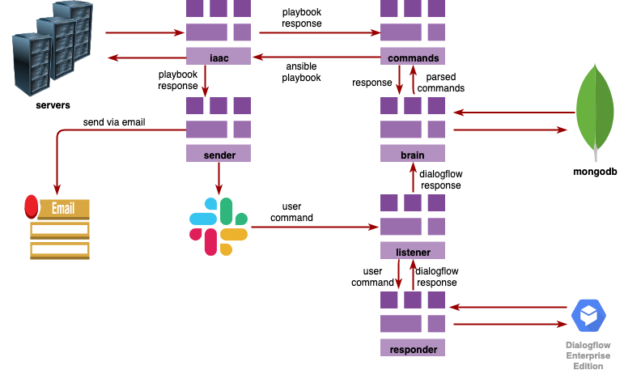

**Circle CI**: [](https://circleci.com/gh/rajatguptarg/samantha)

**Code Maintainability**: [](https://codeclimate.com/github/rajatguptarg/samantha/maintainability)

**Code Climate Test Coverage**: [](https://codeclimate.com/github/rajatguptarg/samantha/test_coverage)

**Coveralls Test Coverage**: [](https://coveralls.io/github/rajatguptarg/samantha?branch=master)

**Travis CI**: [](https://travis-ci.com/rajatguptarg/samantha)


Bot for managing deployments and monitoring infrastructure.


## Introduction

To learn about building bots, please refer to [Setting Up Slack Bot](/docs/tutorial/README.md).

## Install

* First install the dependencies by:

    ```shell
    pip install -r requirements.txt
    ```

* Create the application configuration file in YAML format just like `config.yml` and fill all the values correctly. The `config.yml` should look like:

    ```yaml
    smtp:
      username: test
      password: test
      host: test
      port: 123
      sender: test
      sender_name: test

    slack:
      bot_token: test

    ansible:
      vault_pass: test
      inventory_file: /samantha/iaac/inventory/

    dialogflow:
      project_id: test
      session_id: test
      lang_code: en
      credentials_file: /samantha/dev_credentials.json

    commands_settings:
      log_fetcher:
        send_via:
          - email
          - slack
        log_file_map:
          rts:
            prod: /va/log/syslog
            staging: /va/log/syslog
            qa: /va/log/syslog
            dev: /va/log/syslog
    ```


* Either set the following environment variables or:

    ```shell
    export CONFIG_FILE="/path/to/config.yml"
    export LOG_LEVEL=1
    ```

* Run the project by passing command line args:

    ```shell
    python run.py -c /path/to/config.yml -d
    ```


## Build

If you want to build your own version of Samantha, you need the following:

* DiaglogFlow
* Slack Bot
* Ansible

## Architecture

The architecture of Samantha as follows:




User can choose, whether to send data to slack or to email.

## Deploy

Coming Soon!


## Onboarding

The onboaring involves adding new servers for Samantha to reach or modify the existing commands for your need. Here are list of commands for onboarding:

* [Log Fetcher](docs/onboarding/log-fetcher.md)
